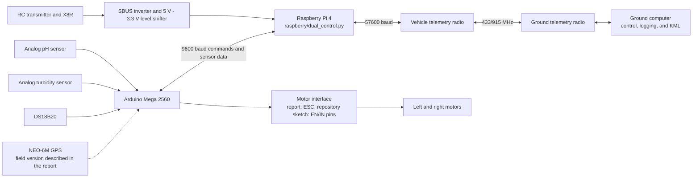

# Water-Quality Unmanned Surface Vehicle

[Türkçe dokümantasyon](README.md)

This project is an unmanned surface vehicle prototype that associates pH, turbidity, and water-temperature measurements with location data. It supports both RC and ground-computer control. The system consists of an Arduino sensor/motor layer, a Raspberry Pi control bridge, and a Python ground station.

> **Physical safety:** Software tests cannot fully validate real motors, ESCs/motor drivers, or a vessel on water. Perform the first run with propellers removed or the vessel safely restrained. The operator must have a physical power-disconnect option.

## System overview



The report and the Arduino sketch in this repository may describe different field variants. The report includes GPS and ESC control, while the current sketch does not read GPS and uses direction/enable pins. Read the [architecture and discrepancy notes](docs/ARCHITECTURE_EN.md) before connecting hardware.

## Key features

**What the project does**

- Travels on the water surface and collects pH, turbidity, and water-temperature measurements at different points.
- Supports operation by RC transmitter or keyboard commands from the ground computer.
- Associates sensor measurements with position and time information and records them at the ground station.
- Displays the collected values on a map as separate pH, turbidity, and temperature layers.
- Helps compare sampling areas and examine spatial changes in water quality.

**Methods used**

- Samples the analog voltage of the pH sensor and converts it to pH through a calibration relationship.
- Measures the analog output of the turbidity sensor and classifies water condition using defined thresholds.
- Measures water temperature with a DS18B20 sensor over OneWire communication.
- Adds coordinates from a NEO-6M GPS in the field version described by the report; the Arduino sketch currently in the repository does not read GPS.
- Uses SBUS channels from the X8R receiver for manual motion and control-mode selection.
- Uses the Raspberry Pi to select between RC and ground-computer control and to bridge the Arduino and telemetry link.
- Records measurements on the ground computer and generates KML map layers whose colors represent value ranges.

## Repository layout

| Path | Responsibility |
| --- | --- |
| `raspberry/` | Raspberry Pi RC/computer bridge and platform dependencies |
| `pc/` | Logger, keyboard control, diagnostics, and KML applications |
| `arduino/` | Arduino IDE-compatible firmware and library list |
| `usv_monitoring/` | Testable configuration, protocol, control, SBUS, storage, and KML modules |
| `tests/` | Hardware-independent automated tests |
| `docs/` | Architecture, field operations, and report review |
| Legacy root `.py` files | Compatibility launchers for existing field commands |

Implementations live in platform directories. The historical `xslx` typo and root launchers are retained to avoid breaking field commands.

## Installation

Python 3.9 or later is required. Python 3.11 is recommended.

### Using uv

```bash
uv sync --extra dev
```

### Using venv and pip

```bash
python3 -m venv .venv
source .venv/bin/activate
python -m pip install -r requirements-dev.txt
```

The Arduino sketch requires `OneWire` and `DallasTemperature`. If the GPS/ESC field firmware described by the report is used, verify its additional `TinyGPSPlus` and `Servo` dependencies.

## Configuration

Defaults match the original field scripts. Override them with environment variables instead of editing source code:

```bash
cp .env.example .env
export USV_ARDUINO_PORT=/dev/ttyUSB1
export USV_TELEMETRY_PORT=/dev/ttyUSB0
export USV_GROUND_PORT=/dev/tty.usbserial-0001
```

The application does not load `.env` automatically; load it through the shell, systemd, or the runtime environment. All options are documented in [.env.example](.env.example).

## Running the system

Raspberry Pi control bridge:

```bash
python -m raspberry.dual_control
```

The legacy `python DualControl.py` command starts the same implementation.

Ground-station logger and keyboard control:

```bash
python -m pc.xlsx_logger --port /dev/tty.usbserial-0001 --output all_sensors.xlsx
```

Logger on a headless system:

```bash
python -m pc.xlsx_logger --no-keyboard
```

Keyboard-only control:

```bash
python -m pc.telemetry
```

KML generation:

```bash
python -m pc.xlsx_to_kml --input all_sensors.xlsx --output-dir maps
```

Open [water_quality_usv.ino](arduino/water_quality_usv/water_quality_usv.ino) with Arduino IDE.

## Supported telemetry formats

Field format shown in the report:

```text
LAT=38.743804,LON=35.468315,PH=7.29,TURB=32,STATUS=CLOUDY,TEMP=19.87
```

Legacy logger format:

```text
DATA,38.743804,35.468315,7.29,32,CLOUDY,19.87
```

`GPS_NO_FIX` and diagnostic lines without coordinates are not logged as measurements. Values outside pH `0..14`, coordinate, or DS18B20 ranges are retained and surfaced as operator warnings.

## Tests and quality checks

```bash
python -m pytest
ruff check .
```

GitHub Actions runs lint and tests on Python 3.9, 3.11, and 3.13.

## Data privacy

Raw XLSX/KML field outputs may contain sensitive GPS coordinates and are ignored by Git by default. The graduation report is also excluded because its résumé page contains personal contact and address information.

## Documentation

- [Architecture, class/function boundaries, and all diagrams](docs/ARCHITECTURE_EN.md)
- [Field operation and safety checklist](docs/OPERATIONS_EN.md)
- [Detailed graduation-report review](docs/REPORT_REVIEW_EN.md)

## License

This project is licensed under the [MIT License](LICENSE). You may use, modify,
and distribute the source code provided that the copyright notice and license
text are retained in copies. Third-party dependencies remain subject to their
respective licenses.
