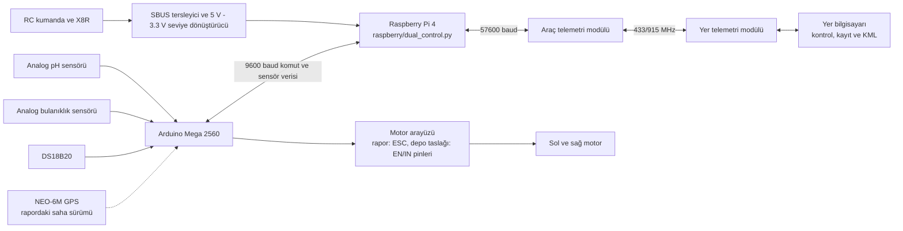

# Su Analizi Yapan İnsansız Su Aracı

[English documentation](README.en.md)

Bu proje; pH, bulanıklık ve su sıcaklığı ölçümlerini konum bilgisiyle eşleştiren, uzaktan kumanda ve yer bilgisayarı kontrolünü destekleyen bir insansız su aracı prototipidir. Sistem Arduino tabanlı sensör/motor katmanı, Raspberry Pi tabanlı kontrol köprüsü ve Python tabanlı yer istasyonundan oluşur.

> **Fiziksel güvenlik:** Yazılım testleri gerçek motor, ESC/motor sürücü veya su üzerindeki aracı tamamen doğrulayamaz. İlk çalıştırmayı pervaneler sökülmüşken ya da araç güvenli biçimde sabitlenmişken yapın. Operatörün fiziksel güç kesme imkânı bulunmalıdır.

## Sistem özeti



Rapor ile bu depodaki Arduino taslağı aynı saha varyantını temsil etmiyor olabilir. Rapor GPS ve ESC kullanımını gösterirken mevcut taslak GPS okumuyor ve yön/enable pinleri kullanıyor. Donanım bağlamadan önce [mimari ve uyumsuzluk notlarını](docs/ARCHITECTURE_TR.md) okuyun.

## Temel özellikler

**Projenin yaptığı işler**

- Su yüzeyinde hareket ederek farklı noktalardan pH, bulanıklık ve su sıcaklığı verisi toplar.
- Aracın uzaktan kumandayla veya yer bilgisayarından klavye komutlarıyla yönetilmesini sağlar.
- Sensör ölçümlerini konum ve zaman bilgisiyle ilişkilendirerek yer istasyonunda kaydeder.
- Toplanan değerleri pH, bulanıklık ve sıcaklık katmanları hâlinde harita üzerinde gösterir.
- Ölçüm bölgelerinin karşılaştırılmasına ve su kalitesindeki mekânsal değişimin incelenmesine yardımcı olur.

**Kullanılan yöntemler**

- pH sensörünün analog gerilimi örneklenir ve kalibrasyon bağıntısıyla pH değerine dönüştürülür.
- Bulanıklık sensörünün analog çıkışı ölçülür; belirlenen eşiklere göre su durumu sınıflandırılır.
- DS18B20 sensörüyle su sıcaklığı OneWire haberleşmesi üzerinden ölçülür.
- Raporda anlatılan saha sürümünde NEO-6M GPS ile her ölçüme koordinat eklenir; depodaki mevcut Arduino taslağında GPS okuması bulunmaz.
- X8R alıcısından gelen SBUS kanalları manuel hareket ve kontrol modu seçimi için kullanılır.
- Raspberry Pi, kumanda ile yer bilgisayarı arasındaki kontrol seçimini yapar ve Arduino ile telemetri hattı arasında köprü kurar.
- Yer bilgisayarı ölçümleri tabloya kaydeder ve değer aralıklarını renklerle temsil eden KML harita katmanları üretir.

## Depo yapısı

| Yol | Sorumluluk |
| --- | --- |
| `raspberry/` | Raspberry Pi RC/bilgisayar kontrol köprüsü ve platform bağımlılıkları |
| `pc/` | Logger, klavye kontrolü, tanılama ve KML uygulamaları |
| `arduino/` | Arduino IDE uyumlu firmware ve kütüphane listesi |
| `usv_monitoring/` | Test edilebilir yapılandırma, protokol, kontrol, SBUS, kayıt ve KML modülleri |
| `tests/` | Donanımsız otomatik testler |
| `docs/` | Mimari, saha işletimi ve rapor incelemesi |
| Kökteki eski `.py` dosyaları | Önceki saha komutlarını koruyan uyumluluk başlatıcıları |

Gerçek uygulamalar platform klasörlerindedir. Eski dosya adlarındaki `xslx` yazımı ve kök başlatıcıları, saha komutlarını kırmamak için korunmuştur.

## Kurulum

Python 3.9 veya üzeri gerekir. Önerilen sürüm Python 3.11'dir.

### uv ile

```bash
uv sync --extra dev
```

### venv ve pip ile

```bash
python3 -m venv .venv
source .venv/bin/activate
python -m pip install -r requirements-dev.txt
```

Arduino için `OneWire` ve `DallasTemperature` kütüphaneleri gerekir. Raporda belirtilen GPS/ESC saha firmware'i kullanılacaksa ayrıca `TinyGPSPlus` ve `Servo` gereksinimleri doğrulanmalıdır.

## Yapılandırma

Varsayılanlar mevcut saha betikleriyle aynıdır. Kaynak kodu değiştirmeden ortam değişkenleriyle geçersiz kılınabilir:

```bash
cp .env.example .env
export USV_ARDUINO_PORT=/dev/ttyUSB1
export USV_TELEMETRY_PORT=/dev/ttyUSB0
export USV_GROUND_PORT=/dev/tty.usbserial-0001
```

`.env` otomatik okunmaz; shell, systemd veya çalıştırma ortamınız tarafından yüklenmelidir. Tüm seçenekler [.env.example](.env.example) içinde açıklanmıştır.

## Çalıştırma

Raspberry Pi kontrol köprüsü:

```bash
python -m raspberry.dual_control
```

Eski `python DualControl.py` komutu da aynı uygulamayı başlatır.

Yer istasyonu logger ve klavye kontrolü:

```bash
python -m pc.xlsx_logger --port /dev/tty.usbserial-0001 --output all_sensors.xlsx
```

Grafik ortamı olmayan bir sistemde logger:

```bash
python -m pc.xlsx_logger --no-keyboard
```

Yalnız uzaktan klavye kontrolü:

```bash
python -m pc.telemetry
```

KML üretimi:

```bash
python -m pc.xlsx_to_kml --input all_sensors.xlsx --output-dir maps
```

Arduino IDE ile [water_quality_usv.ino](arduino/water_quality_usv/water_quality_usv.ino) dosyasını açın.

## Desteklenen telemetri formatları

Raporun saha formatı:

```text
LAT=38.743804,LON=35.468315,PH=7.29,TURB=32,STATUS=CLOUDY,TEMP=19.87
```

Eski logger formatı:

```text
DATA,38.743804,35.468315,7.29,32,CLOUDY,19.87
```

`GPS_NO_FIX` ve GPS içermeyen tanılama satırları Excel'e ölçüm olarak yazılmaz. pH `0..14`, koordinat veya DS18B20 aralığı dışındaki değerler kaybedilmez; operatöre veri uyarısı verilir.

## Test ve kalite kontrolü

```bash
python -m pytest
ruff check .
```

GitHub Actions; Python 3.9, 3.11 ve 3.13 üzerinde lint ve test çalıştırır.

## Veri gizliliği

Ham XLSX/KML saha çıktıları GPS koordinatları içerebilir ve varsayılan olarak Git'e alınmaz. Bitirme raporunun özgeçmiş sayfasında kişisel iletişim/adres bilgileri bulunduğu için PDF de bu depoya eklenmez.

## Dokümantasyon

- [Mimari, sınıf/fonksiyon ayrımı ve tüm diyagramlar](docs/ARCHITECTURE_TR.md)
- [Saha çalıştırma ve güvenlik kontrol listesi](docs/OPERATIONS_TR.md)
- [Bitirme raporu ayrıntılı incelemesi](docs/REPORT_REVIEW_TR.md)

## Lisans

Bu proje [MIT Lisansı](LICENSE) ile lisanslanmıştır. Kaynak kodu kullanabilir,
değiştirebilir ve dağıtabilirsiniz; telif hakkı bildirimi ile lisans metnini
kopyalarda korumanız gerekir. Üçüncü taraf bağımlılıklar kendi lisanslarına tabidir.
