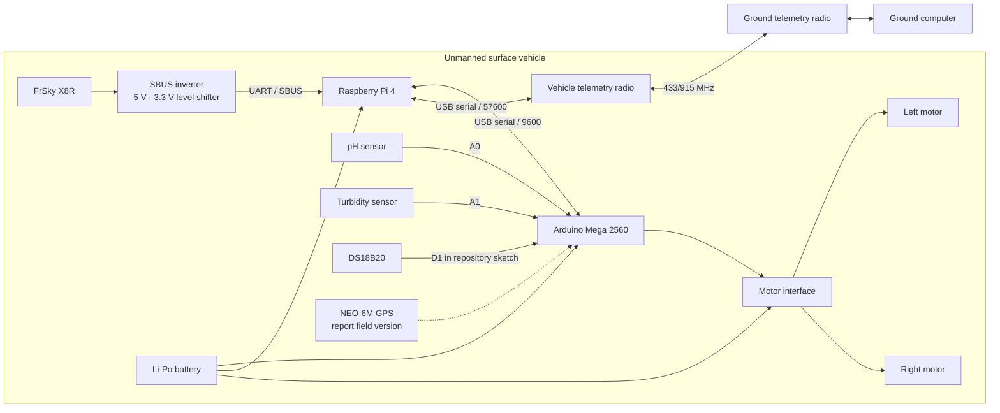
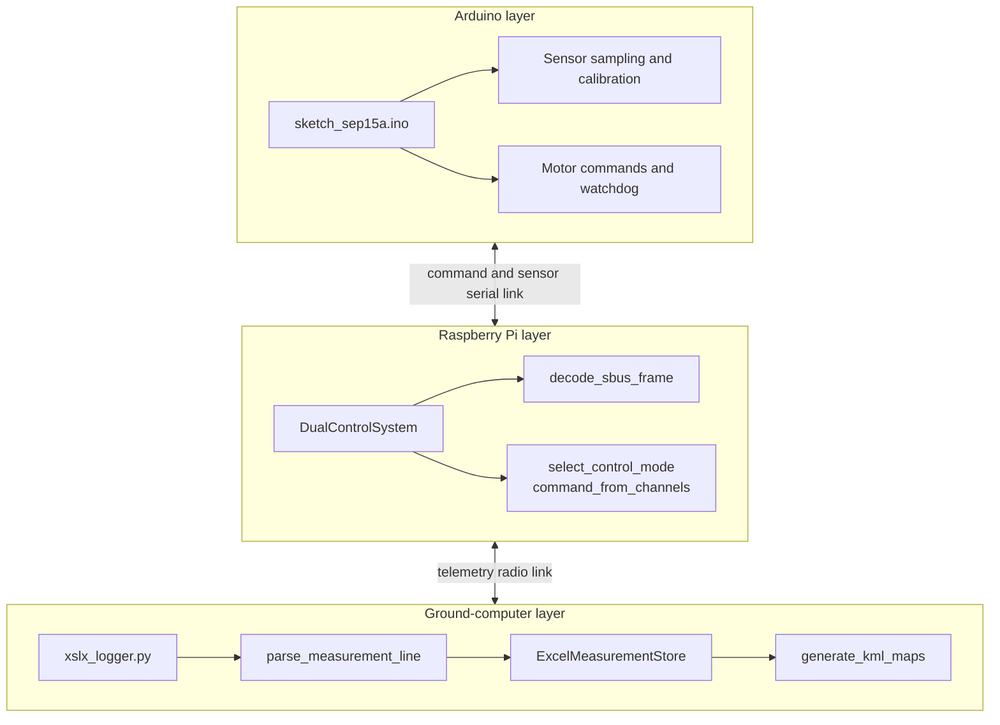
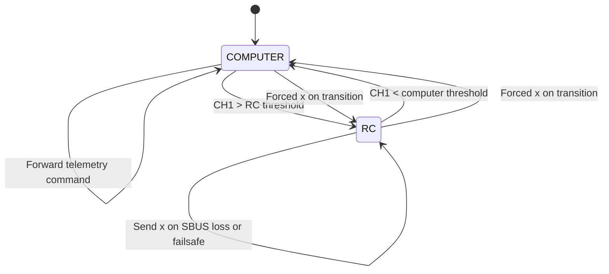
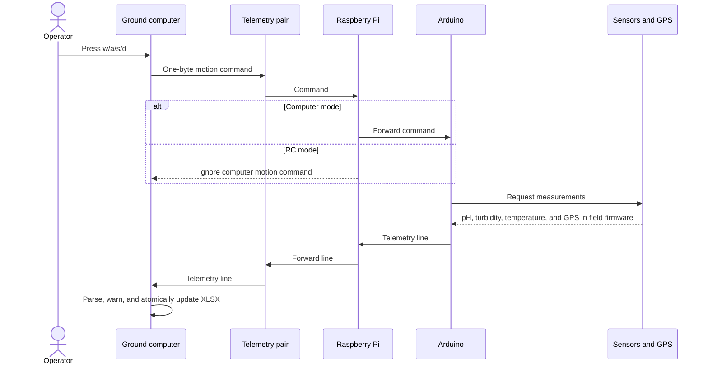
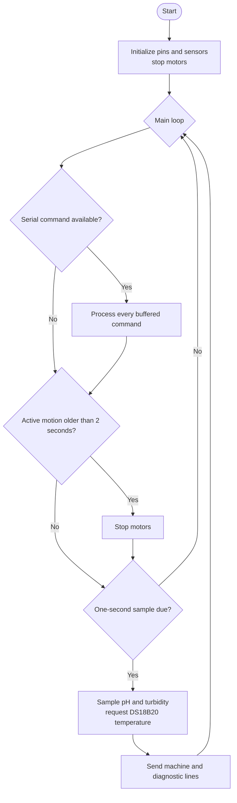
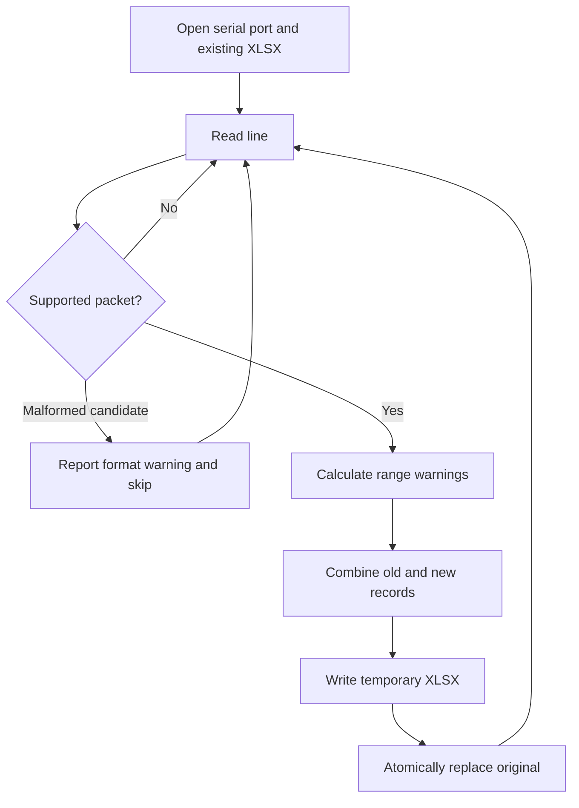
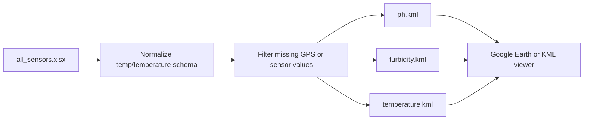
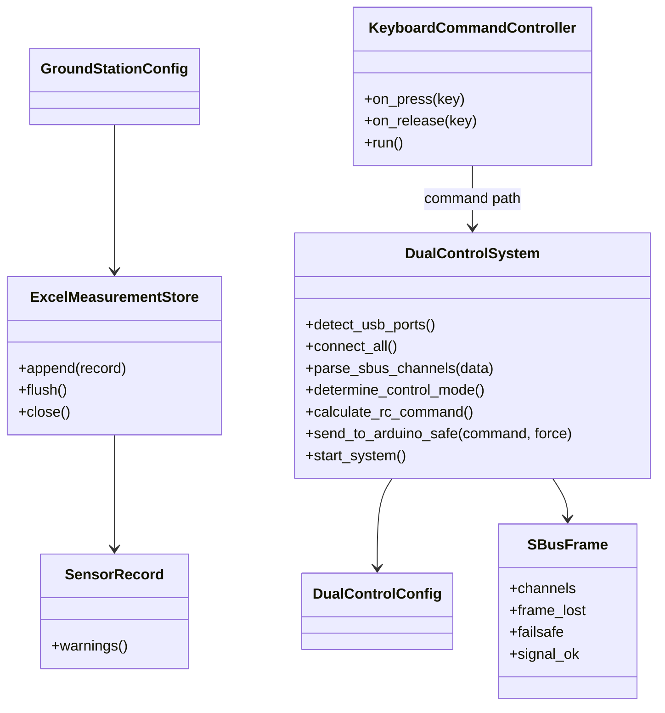

# Architecture and code boundaries

[Türkçe](ARCHITECTURE_TR.md) | [Main README](../README.en.md)

This refactor keeps the proven field entry points while separating hardware-independent logic into small modules. `DualControl.py`, `xslx_logger.py`, `telemetry.py`, `keyboard.py`, and `xslx_to_kml.py` retain their original command names.

## Extracted classes and functions

| Component | New location | Reason for separation |
| --- | --- | --- |
| `DualControlConfig`, `GroundStationConfig` | `usv_monitoring/config.py` | Moves ports, baud rates, thresholds, and paths out of source while preserving field defaults. |
| `SensorRecord` | `usv_monitoring/protocol.py` | Defines one explicit measurement contract. |
| `parse_measurement_line()` | `usv_monitoring/protocol.py` | Supports both the report's `KEY=VALUE` and legacy `DATA,...` formats. |
| `select_control_mode()` | `usv_monitoring/control.py` | Tests hysteresis without serial hardware. |
| `command_from_channels()` | `usv_monitoring/control.py` | Pure RC-channel-to-motion mapping. |
| `decode_sbus_frame()` and `SBusFrame` | `usv_monitoring/sbus.py` | Separates bit decoding from failsafe/frame-loss decisions. |
| `ExcelMeasurementStore` | `usv_monitoring/storage.py` | Loads old records, appends new ones, and atomically replaces XLSX output. |
| `KeyboardCommandController` | `usv_monitoring/keyboard_control.py` | Reuses the `pynput` lifecycle in logger and control-only clients. |
| `generate_kml_maps()` | `usv_monitoring/kml.py` | Separates colors, geographic geometry, and XML generation from the CLI. |
| `DualControlSystem` | `DualControl.py` | Orchestrates hardware connections, threads, and system lifecycle. |

The boundary is intentionally conservative: the five field scripts were not replaced with a new framework. Only decisions that require testing were extracted.

## 1. Hardware architecture

Repository pin mapping: pH `A0`, turbidity `A1`, DS18B20 `D1`, motor enables `D9`/`D3`, and motor directions `D7`/`D6`/`D5`/`D4`.

**Critical item to verify:** `D1` is TX0 on an Arduino Mega. The current sketch uses it for both `Serial` and OneWire. If the working field build uses another UART, board, or sensor pin, update source and wiring together. This refactor did not guess a physical pin.

The report describes SimonK ESCs controlled through `Servo`, while the repository sketch uses `ENA/ENB` and `IN1..IN4`. Confirm the installed motor electronics before flashing the sketch.

## 2. Software deployment

## 3. Control-mode state machine

The previous mode is retained within `1300..1700`. Transition stops bypass command deduplication.

## 4. Command and telemetry sequence

## 5. Arduino loop and safety

The watchdog prevents indefinite motion after a serial-link loss. A synchronous DS18B20 request may block the loop for hundreds of milliseconds; measure actual stop latency on the physical build.

## 6. Ground-station logging

Out-of-range scientific data are retained for investigation instead of being silently changed.

## 7. Mapping pipeline

Longitude span is adjusted for latitude. The default `--half-size-m 4` creates an approximately eight-metre full square.

## 8. Class and module relationships

## Safety invariants

1. Every control-mode transition writes a forced `x` to the physical link.
2. SBUS failsafe, frame loss, or timeout changes RC motion to `x`.
3. Arduino stops motors after two seconds without a new motion command.
4. Partially opened serial connections are closed after connection failure.
5. USB auto-detection assigns Arduino only after recognizing readable telemetry.
6. Validation warnings never silently modify raw scientific observations.

These controls do not replace a physical emergency stop, fuse, correct ESC arming process, or operator supervision.
