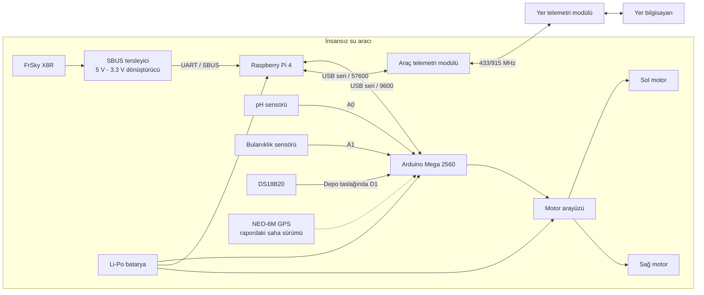
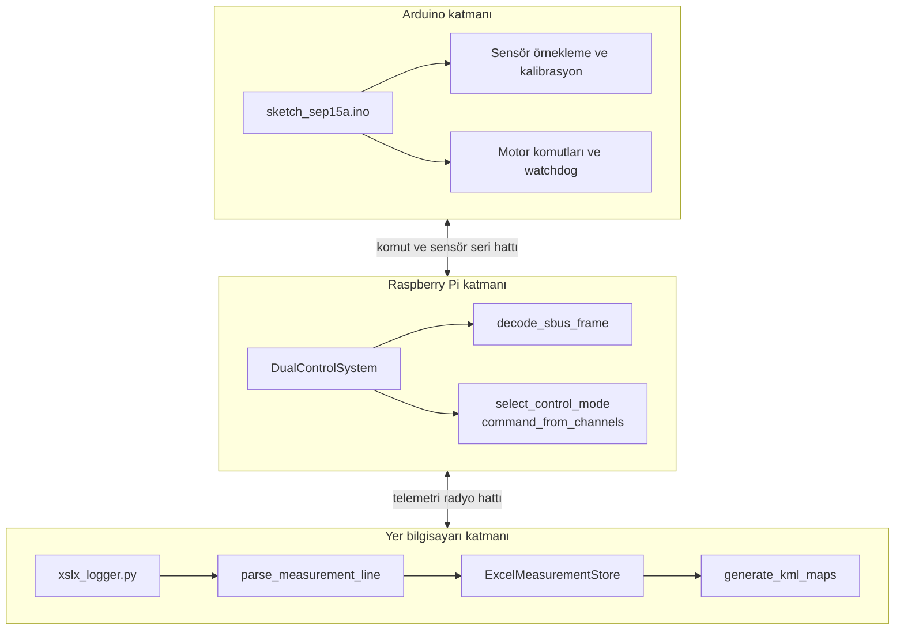
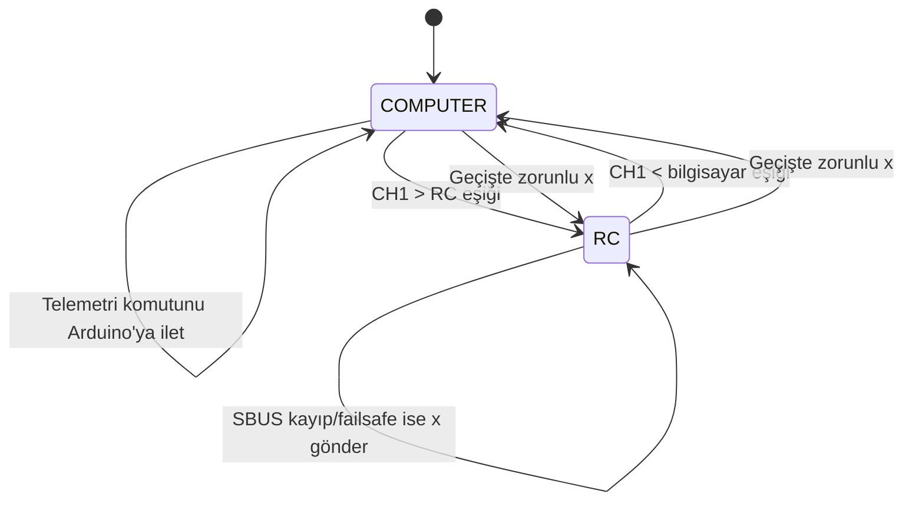
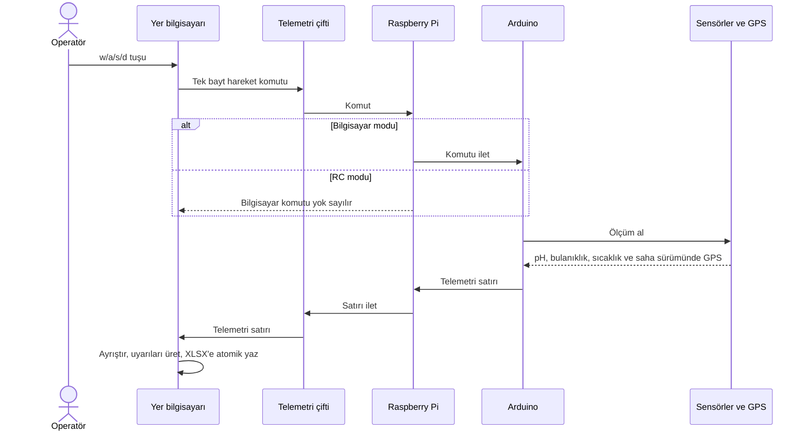
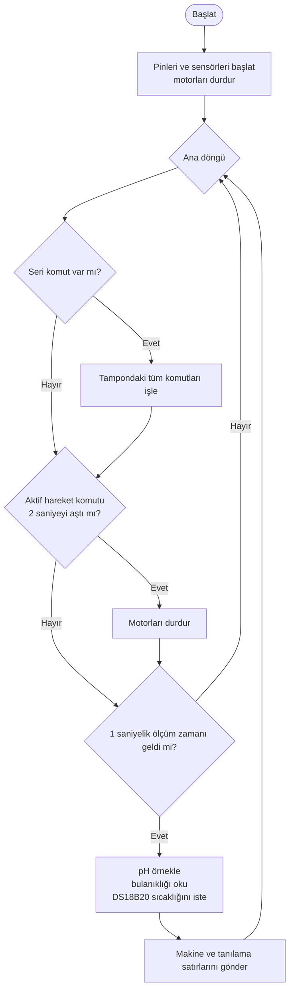
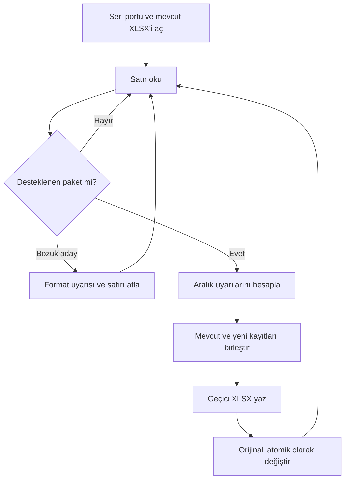
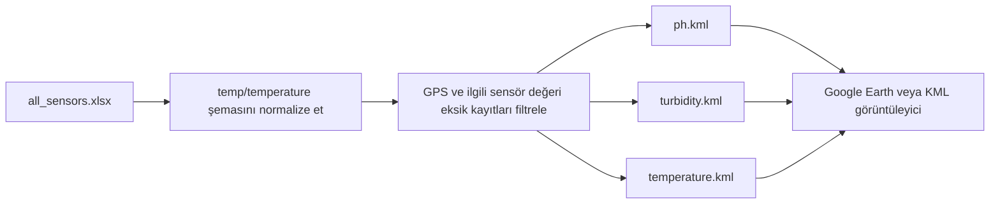
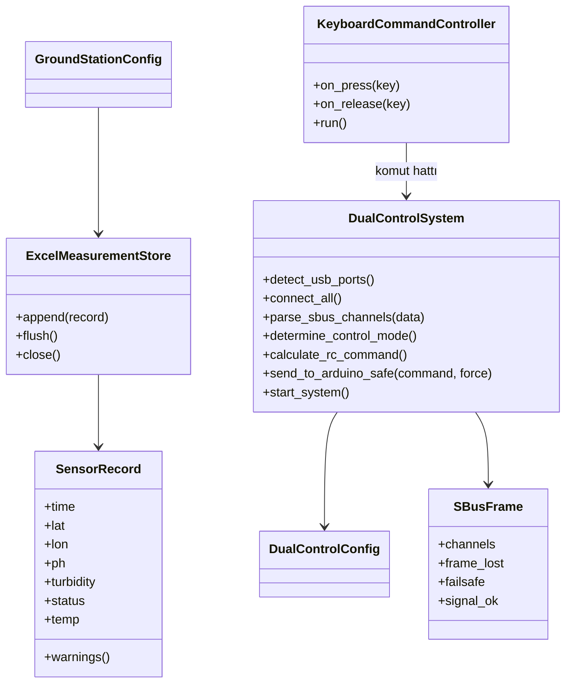

# Mimari ve kod ayrımı

[English](ARCHITECTURE_EN.md) | [Ana README](../README.md)

Bu düzenleme, çalışan saha giriş noktalarını korurken donanımdan bağımsız mantığı küçük modüllere ayırır. `DualControl.py`, `xslx_logger.py`, `telemetry.py`, `keyboard.py` ve `xslx_to_kml.py` komutları aynı adlarla kalmıştır.

## Ayrılan sınıflar ve fonksiyonlar

| Parça | Yeni konum | Neden ayrı olmalı? |
| --- | --- | --- |
| `DualControlConfig`, `GroundStationConfig` | `usv_monitoring/config.py` | Port, baud, eşik ve dosya yollarını koddan ayırır; saha varsayılanlarını korur. |
| `SensorRecord` | `usv_monitoring/protocol.py` | Bir ölçümün tek ve açık veri sözleşmesidir. |
| `parse_measurement_line()` | `usv_monitoring/protocol.py` | Raporun `KEY=VALUE` ve eski `DATA,...` formatlarını tek yerde yönetir. |
| `select_control_mode()` | `usv_monitoring/control.py` | Histerezis davranışını seri donanım olmadan test eder. |
| `command_from_channels()` | `usv_monitoring/control.py` | RC kanal değerlerini hareket komutuna dönüştüren saf fonksiyondur. |
| `decode_sbus_frame()` ve `SBusFrame` | `usv_monitoring/sbus.py` | Bit çözümleme ile failsafe/frame-loss kararını ayırır. |
| `ExcelMeasurementStore` | `usv_monitoring/storage.py` | Eski kayıtları yükler, yeni kayıtları ekler ve atomik XLSX değişimi yapar. |
| `KeyboardCommandController` | `usv_monitoring/keyboard_control.py` | `pynput` yaşam döngüsünü logger ve yalnız-kontrol uygulamalarında tekrar kullanır. |
| `generate_kml_maps()` | `usv_monitoring/kml.py` | Renk, coğrafi kare ve XML üretimini komut satırı betiğinden ayırır. |
| `DualControlSystem` | `DualControl.py` | Donanım bağlantıları, iş parçacıkları ve sistem yaşam döngüsünün orkestratörüdür. |

Bu ayrımın sınırı bilinçlidir: beş ayrı çalıştırma betiği bir anda yeni bir framework'e dönüştürülmedi. Saha komutları ve varsayılanlar değişmeden, yalnız test edilmesi gereken karar mantığı ayrıldı.

## 1. Donanım mimarisi

### Depodaki Arduino pinleri

| İşlev | Pin |
| --- | --- |
| pH analog giriş | `A0` |
| Bulanıklık analog giriş | `A1` |
| DS18B20 OneWire | `D1` |
| Motor A enable | `D9` |
| Motor B enable | `D3` |
| Motor A yön | `D7`, `D6` |
| Motor B yön | `D5`, `D4` |

**Doğrulanması gereken kritik nokta:** Arduino Mega'da `D1`, `Serial` TX0 işlevidir. Mevcut taslak hem `Serial` hem OneWire için `D1` kullanıyor. Çalışan saha düzeninde farklı seri port, farklı kart veya farklı sensör pini kullanılıyorsa kaynak kod ve kablolama birlikte güncellenmelidir. Bu düzenleme gerçek kablo bilgisi olmadan pini değiştirmedi.

Rapor SimonK ESC ve `Servo` kütüphanesini anlatırken depo taslağı `ENA/ENB` ve `IN1..IN4` pinleriyle bir motor sürücü arayüzü kullanıyor. `sketch_sep15a.ino` yüklenmeden önce hangi motor elektroniğinin bağlı olduğu kesinleştirilmelidir.

## 2. Yazılım dağıtımı

## 3. Kontrol modu durum makinesi

`1300..1700` bandında önceki mod korunur. Geçişteki `x`, tekrar eden komut önbelleğinden bağımsız gönderilir.

## 4. Komut ve telemetri sıralaması

## 5. Arduino ana döngüsü ve güvenlik

Watchdog, seri bağlantı kesildiğinde son hareketin sonsuza kadar sürmesini önler. DS18B20 sıcaklık isteği senkron çalışıyorsa ana döngüyü yüzlerce milisaniye engelleyebilir; gerçek durma gecikmesi saha testinde ölçülmelidir.

## 6. Yer istasyonu kayıt akışı

Aralık dışı pH gibi veriler bilimsel inceleme için korunur; sessizce sıfırlanmaz veya silinmez. Logger operatöre uyarı verir.

## 7. Haritalandırma akışı

Kareler enleme göre boylam ölçeğini düzeltir. Varsayılan `--half-size-m 4`, merkezden her kenara yaklaşık 4 metre; tam kenar yaklaşık 8 metredir.

## 8. Sınıf ve modül ilişkileri

## Güvenlik değişmezleri

1. Her kontrol modu değişimi fiziksel hatta zorunlu `x` gönderir.
2. SBUS failsafe, frame-loss veya zaman aşımı RC hareketini `x` yapar.
3. Arduino iki saniye yeni hareket komutu almazsa motorları durdurur.
4. Başarısız kısmi bağlantıda açılmış seri portlar kapatılır.
5. USB portu yalnız okunabilir Arduino telemetri işareti bulunursa otomatik atanır.
6. Ham ölçüm doğrulama uyarıları veriyi sessizce değiştirmez.

Bu kurallar fiziksel acil durdurma, sigorta, uygun ESC arming süreci ve operatör gözetiminin yerine geçmez.
